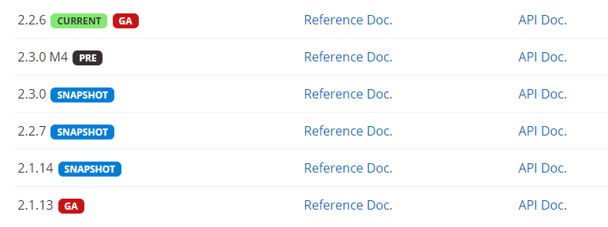
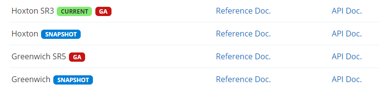
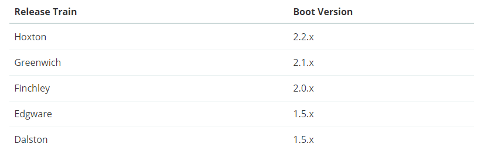
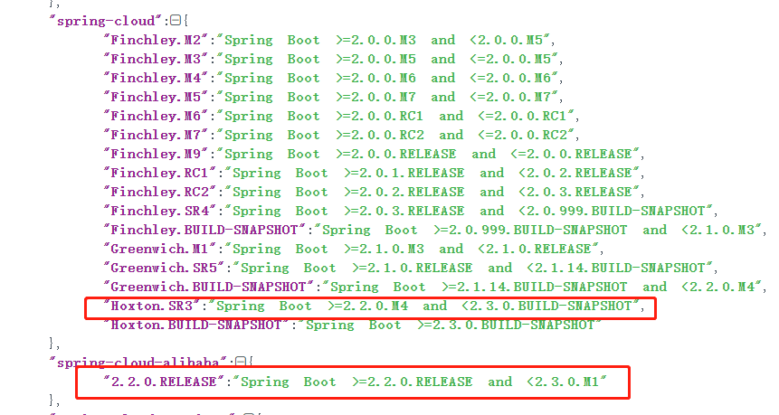
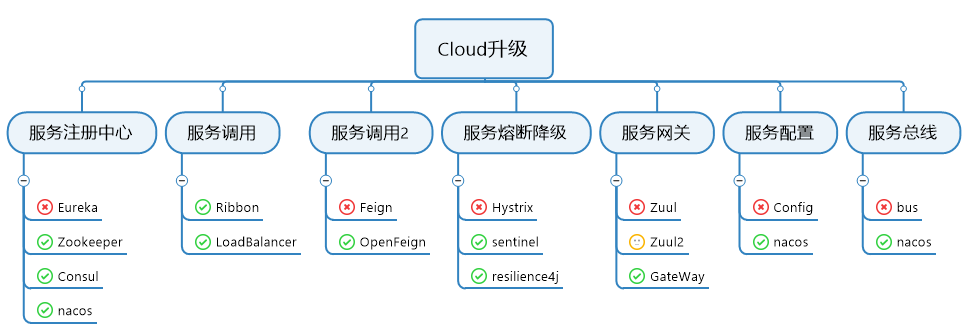

## 1.概述

​	从3月份开始学习SpringCloud微服务架构的基础知识，在断断续续的40多天的时间从各个组件的理论知识到相关demo的搭建，其中学习的过程和跳过的坑都记录在SpringCloud系列文章里面。由于SpringCloud组件较多，篇幅较大，遂将文章按照各组件进行拆分 方便大家的阅读。

​	本文是SpringCloud系列的第一篇文章，着重介绍下SpringCloud的基础知识、相关特性。为后续的文章做铺垫。

##  2.什么是SpringCloud

> Spring Cloud provides tools for developers to quickly build some of the common patterns in distributed systems (e.g. configuration management, service discovery, circuit breakers, intelligent routing, micro-proxy, control bus, one-time tokens, global locks, leadership election, distributed sessions, cluster state). Coordination of distributed systems leads to boiler plate patterns, and using Spring Cloud developers can quickly stand up services and applications that implement those patterns. They will work well in any distributed environment, including the developer’s own laptop, bare metal data centres, and managed platforms such as Cloud Foundry.

简单来说SpringCloud是一套完整微服务解决方案，基于SpringBoot，可以说他不是一个框架，而是一个容器，将市面上较成熟微服务架构集成进来，以提高开发效率。

## 3.版本选择

上面说到SpringCloud是基于SpringBoot，那么在开发的时候如何选择对应的版本呢？

[SpringBoot版本介绍](https://spring.io/projects/spring-boot#learn)

[SpringCloud的版本介绍](https://spring.io/projects/spring-cloud#learn)

**版本号介绍**

- Alpha：不建议使用，主要是以实现软件功能为主，通常只在软件开发者内部交流，Bug较多；
- Beta：该版本相对于α版已有了很大的改进，消除了严重的错误，但还是存在着一些缺陷，需要经过多次测试来进一步消除；
- GA：General Availability，正式版本，官方推荐使用此版本，在国外都是用GA来说明release版本；
- M：又叫里程碑版本，表示该版本较之前版本有功能上的重大更新；
- PRE(不建议使用)：预览版，内部测试版，主要是给开发人员和测试人员测试和找BUG用的；
- Release：最终版本，Release不会以单词形式出现在软件封面上，取而代之的是符号(R)；
- RC：该版本已经相当成熟了，基本上不存在导致错误的BUG，与即将发行的正式版相差无几；
- SNAPSHOT：快照版，可以稳定使用，且仍在继续改进版本。

在官网上已经给了大版本的选择，更详细版本选择可查看https://start.spring.io/actuator/info json返回结果。

最终版本选择结果

|        组件        |     版本      |
| :----------------: | :-----------: |
|    SpringCloud     |  Hoxton.SR3   |
| SpringCloudAlibaba | 2.2.0.RELEASE |
|     SpringBoot     | 2.2.6.RELEASE |
|        JDK         |      1.8      |
|       Maven        |     3.5.3     |

## 4.各种组件的兴衰史？

**停更说明**

[Eureka](https://github.com/Netflix/eureka/wiki)

[Hystrix](https://github.com/Netflix/Hystrix)

[Zuul2](https://github.com/spring-cloud/spring-cloud-netflix/issues/2951)

不适用Config和Bus 作为服务配置中心和消息总线的原因是：SpringCloudAlibaba-nacos整合了服务注册中心 服务配置 服务总线。

# mscloud

@EnableEurekaClient 消费者
@EnableEurekaServer 提供服务

consul 解压路径 配置path
consul --version
启动 consul agent -dev

bootstrap.yml的配置会被中心配置覆盖

一个系统的吞吐量（承压能力）与request对CPU的消耗、外部接口、IO等等紧密关联。单个request 对CPU消耗越高，外部系统接口、IO速度越慢，系统吞吐能力越低，反之越高。

系统吞吐量几个重要参数：QPS（TPS）、并发数、响应时间

        QPS（TPS）：（Query Per Second）每秒钟request/事务 数量
    
        并发数： 系统同时处理的request/事务数
    
        响应时间：  一般取平均响应时间

（很多人经常会把并发数和TPS理解混淆）

理解了上面三个要素的意义之后，就能推算出它们之间的关系：
QPS（TPS）= 并发数/平均响应时间    或者   并发数 = QPS*平均响应时间

TPS获取

新系统：没有历史数据作参考，只能通过业务部门进行评估。

旧系统：对于已经上线的系统，可以选取高峰时刻，在5分钟或10分钟内，获取系统每笔交易的业务量和总业务量，按照单位时间内完成的笔数计算出TPS，即业务笔数/单位时间（5*60或10*60）

例子：
        一个典型的上班签到系统，早上8点上班，7点半到8点的30分钟的时间里用户会登录签到系统进行签到。公司员工为1000人，平均每个员上登录签到系统的时长为5分钟。可以用下面的方法计算。
QPS = 1000/(30*60)  (事务/秒)
平均响应时间为 = 5*60  (秒)
并发数= QPS*平均响应时间 = 1000/(30*60) *(5*60)=166.7

一个系统吞吐量通常由QPS（TPS）、并发数两个因素决定，每套系统这两个值都有一个相对极限值，在应用场景访问压力下，只要某一项达到系统最高值，系统的吞吐量就上不去了，如果压力继续增大，系统的吞吐量反而会下降，原因是系统超负荷工作，上下文切换、内存等等其它消耗导致系统性能下降。

决定系统响应时间要素